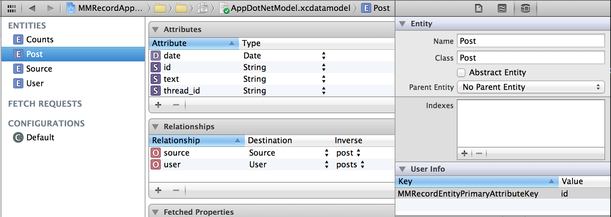
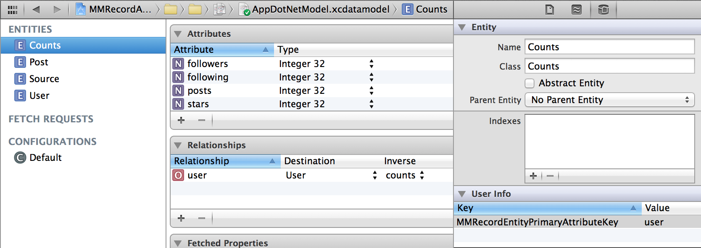
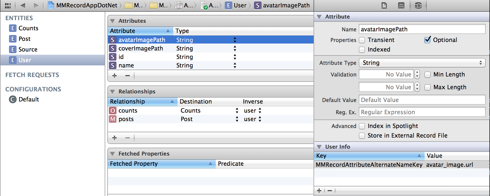

MMRecord
========

MMRecord is a block-based seamless web service integration library for iOS and Mac OS X. It leverages the [Core Data](https://developer.apple.com/library/mac/#documentation/Cocoa/Reference/CoreData_ObjC/_index.html) model configuration to automatically create and populate a complete object graph from an API response. It works with any networking library, is simple to setup, and includes many popular features that make working with web services even easier. Here's how to make a request for App.net Post records:


```objective-c
NSManagedObjectContext *context = [[MMDataManager sharedDataManager] managedObjectContext];

[Post 
 startPagedRequestWithURN:@"stream/0/posts/stream/global"
 data:nil
 context:context
 domain:self
 resultBlock:^(NSArray *posts, ADNPageManager *pageManager, BOOL *requestNextPage) {
	 NSLog(@"Posts: %@", posts);
 }
 failureBlock:^(NSError *error) {
	 NSLog(@"%@", error);
 }];
```

Keep reading to learn more about how to start using MMRecord in your project!

## Getting Started

- [Download MMRecord](https://github.com/mutualmobile/MMRecord/archive/master.zip) and try out the included example apps.
- Continue reading the integration instructions below.
- Check out the [documentation](Documentation/) for all the rest of the details.

## Overview

MMRecord is designed to make it as easy and fast as possible to obtain native objects from a new web service request. It handles all of the fetching, creation, and population of NSManagedObjects for you in the background so that when you make a request, all you get back is the native objects that you can use immediately. No parsing required.

The library is architected to be as simple and lightweight as possible. Here's a breakdown of the core classes in MMRecord.

<table>
  <tr><th colspan="2" style="text-align:center;">Core</th></tr>
  <tr>
    <td><a href="Documentation/Classes/MMRecord.html">MMRecord</a></td>
    <td>
      A subclass of <tt>NSManagedObject</tt> that defines the <tt>MMRecord</tt> interface and initiates the object graph population process.
      
      <ul>
        <li>Entry point for making requests</li>
        <li>Uses a registered <tt>MMServer</tt> class for making requests</li>
        <li>Initiaties the population process using the <tt>MMRecordResponse</tt> class</li>
		<li>Returns objects via a block based interface</li>
      </ul>
    </td>
  </tr>
  <tr>
    <td><a href="Documentation/Classes/MMServer.html">MMServer</a></td>
    <td>
	  An abstract class that defines the request interface used by <tt>MMRecord</tt>.
	  
      <ul>
        <li>Designed to be subclassed</li>
        <li>Supports any networking framework, including local files and servers</li>
      </ul>
    </td>
  </tr>
</table>
  
<p align="center">
  
</p>

<table>
  <tr><th colspan="2" style="text-align:center;">Population</th></tr>
  <tr>
    <td><a href="Documentation/Classes/MMRecord.html">MMRecordResponse</a></td>
    <td>A class that handles the process of turning a response into native <tt>MMRecord</tt> objects.</td>
  </tr>
  <tr>
    <td><a href="Documentation/Classes/MMRecord.html">MMRecordProtoRecord</a></td>
    <td>A container class used as a placeholder for the object graph during the population process.</td>
  </tr>
  <tr>
    <td><a href="Documentation/Classes/MMRecordRepresentation.html">MMRecordRepresentation</a></td>
    <td>A class that defines the mapping between a dictionary and a Core Data <tt>NSEntityDescription</tt>.</td>
  </tr>
  <tr>
    <td><a href="Documentation/Classes/MMRecordMarshaler.html">MMRecordMarshaler</a></td>
    <td>A class responsible for populating an instance of <tt>MMRecord</tt> based on the <tt>MMRecordRepresentation</tt>.</td>
  </tr>

  <tr><th colspan="2" style="text-align:center;">Pagination</th></tr>
  <tr>
    <td><a href="Documentation/Classes/MMServerPageManager.html">MMServerPageManager</a></td>
    <td>An abstract class that defines the interface for handling pagination.</td>
  </tr>
  
  <tr><th colspan="2" style="text-align:center;">Caching</th></tr>
  <tr>
    <td><a href="Documentation/Classes/MMRecord.html">MMRecordCache</a></td>
    <td>An class that maps <tt>NSManagedObject</tt> ObjectIDs to an <tt>NSCachedURLResponse</tt>	.</td>
  </tr>
</table>

<p align="center">
  
</p>

## Integration Guide

MMRecord does require some basic setup before you can use it to make requests. This guide will go take you through the steps in that configuration process.

### Server Class Configuration

MMRecord requires a registered server class to make requests. The server class should know how to make a request to the API you are integrating with. The only requirement of a server implementation is that it return a response object (array or dictionary) that contains the objects you are requesting. A server might use [AFNetworking](https://github.com/AFNetworking/AFNetworking) to perform a GET request to a specific API. Or it might load and return local JSON files. There are two sub specs which provide pre-built servers that use AFNetworking and local JSON files. Generally speaking though, you are encouraged to implement your own server to talk to the API you are using.

Once you have defined your server class, you must register it with MMRecord:

```objective-c
[Post registerServerClass:[ADNServer class]];
```

Note that you can register different server classes on different subclasses of MMRecord.

```objective-c
[Tweet registerServerClass:[TWSocialServer class]];
[User registerServerClass:[MMJSONServer class]];
```

This is helpful if one endpoint you are working with is complete, but another is not, or is located on another API.

### MMRecord Subclass Implementation

You are required to override one method on your subclass of MMRecord in order to tell the parsing system where to locate the object(s) are tbat you wish to parse. This method returns a key path that specifies the location relative to the root of the response object. If your response object is an array, you can just return nil.

In an App.net request, all returned objects are located in an object called "data", so our subclass of <tt>MMRecord</tt> will look like this:

```objective-c
@interface ADNRecord : MMRecord
@end

static NSDateFormatter *ADNRecordDateFormatter;

@implementation ADNRecord

+ (NSString *)keyPathForResponseObject {
    return @"data";
}

+ (NSDateFormatter *)dateFormatter {
    if (!ADNRecordDateFormatter) {
        NSDateFormatter *dateFormatter = [[NSDateFormatter alloc] init];
        [dateFormatter setDateFormat:@"yyyy-MM-dd'T'HH:mm:ssZ"]; // "2012-11-21T03:57:39Z"
        ADNRecordDateFormatter = dateFormatter;
    }
    
    return ADNRecordDateFormatter;
}

@end
```
There are also some optional methods you may wish to implement on <tt>MMRecord</tt>. One such method returns a date formatter configured for populating attributes of type Date.

Note that these methods were implemented on a class called <tt>ADNRecord</tt>, which is a subclass of <tt>MMRecord</tt>. Additional entities are subclasses of <tt>ADNRecord</tt>, and do not need to implement these methods themselves.

### Model Configuration

The Core Data <tt>NSManagedObjectModel</tt> is very useful. At a highlevel, the model is composed of a list of entities. Likewise, an API is typically composed of a list of endpoints. MMRecord takes advantage of this convention to map an entity representation to an endpoint representation in order to create native objects from an API response. 

MMRecord leverages the introspective properties of the Core Data model to decide how to parse a response. The class you start the request from is considered to be the root of the object graph. From there, MMRecord looks at that <tt>NSEntityDescription</tt>'s attributes and relationships and attempts to populate each of them from the given response object. That information is very helpful, because it makes population of most attributes very straightforward. Because of this, it's helpful if your data model entity representations maps very closely to your API endpoint response representations.

#### Primary Key

MMRecord works best if there is a way to uniquely identify records of a given entity type. That allows it to fetch the existing record (if it exists) and update it, rather than create a duplicate one. To designate the primary key for an entity, we leverage the entity's user info dictionary. Specify the name of the primary key property as the value, and <b>MMRecordEntityPrimaryAttributeKey</b> as the key.



Note that the primary key can be any property, which includes a relationship. If a relationship is used as the primary key, MMRecord will attempt to fetch the parent object and search for the associated object in the relationship.



#### Alternate Property Names

Sometimes, you may need to define an alternate name for a property on one of your entities. This could be for a variety of reasons. Perhaps you don't like your Core Data property names to include underscores? Perhaps the API response changed, and you don't want to change your NSManagedObject property names. Or maybe the value of a property is actually inside of a sub-object, and you need to bring it up to root level. Well, that's what the <b>MMRecordAttributeAlternateNameKey</b> is for. You can define this key on any attribute or relationship user info dictionary. The value of this key can be an alternate name, or alternate keyPath that will be used to locate the object for that property.



For reference, here's a truncated version of the App.net User object to illustrate how those configuration values were determined:

```objective-c
{
    "id": "1", // note this is a string
    "username": "johnappleseed",
    "name": "John Appleseed",
    "avatar_image": {
        "height": 512,
        "width": 512,
        "url": "https://example.com/avatar_image.jpg",
        "is_default": false
    },
    "cover_image": {
        "width": 320,
        "height": 118,
        "url": "https://example.com/cover_image.jpg",
        "is_default": false
    },
	"counts": {
		"following": 100,
		"followers": 200,
        "posts": 24,
        "stars": 76
    }
}
```

## Example Usage

### Standard Request

```objective-c
+ (void)favoriteTweetsWithContext:(NSManagedObjectContext *)context
                           domain:(id)domain
                      resultBlock:(void (^)(NSArray *tweets))resultBlock
                     failureBlock:(void (^)(NSError *))failureBlock {
    [Tweet startRequestWithURN:@"favorites/list.json"
                          data:nil
                       context:context
                        domain:self
                   resultBlock:resultBlock
                  failureBlock:failureBlock];
}
```

### Paginated Request

```objective-c
@interface Post : ADNRecord
+ (void)getStreamPostsWithContext:(NSManagedObjectContext *)context
                           domain:(id)domain
                      resultBlock:(void (^)(NSArray *posts, ADNPageManager *pageManager, BOOL *requestNextPage))resultBlock
                     failureBlock:(void (^)(NSError *error))failureBlock;
@end

@implementation Post
+ (void)getStreamPostsWithContext:(NSManagedObjectContext *)context
                           domain:(id)domain
                      resultBlock:(void (^)(NSArray *posts, ADNPageManager *pageManager, BOOL *requestNextPage))resultBlock
                     failureBlock:(void (^)(NSError *error))failureBlock {
    [self startPagedRequestWithURN:@"stream/0/posts/stream/global"
                              data:nil
                           context:context
                            domain:self
                       resultBlock:resultBlock
                      failureBlock:failureBlock];
}
@end
```

### Batched Request

```objective-c
[Tweet startBatchedRequestsInExecutionBlock:^{
    [Tweet
     timelineTweetsWithContext:context
     domain:self
     resultBlock:^(NSArray *tweets, MMServerPageManager *pageManager, BOOL *requestNextPage) {
         NSLog(@"Timeline Request Complete");
     }
     failureBlock:^(NSError *error) {
         NSLog(@"%@", error);
     }];
    
    [Tweet
     favoriteTweetsWithContext:context
     domain:self
     resultBlock:^(NSArray *tweets, MMServerPageManager *pageManager, BOOL *requestNextPage) {
         NSLog(@"Favorites Request Complete");
     }
     failureBlock:^(NSError *error) {
         NSLog(@"%@", error);
     }];
} withCompletionBlock:^{
    NSLog(@"Request Complete");
}];
```

### Fetch First Request

```objective-c
NSFetchRequest *fetchRequest = [NSFetchRequest fetchRequestWithEntityName:@"User"];
NSPredicate *predicate = [NSPredicate predicateWithFormat:@"SELF.name contains[c] %@", name];
NSSortDescriptor *sortDescriptor = [NSSortDescriptor sortDescriptorWithKey:@"name" ascending:YES];
fetchRequest.predicate = predicate;
fetchRequest.sortDescriptors = @[sortDescriptor];

[self
 startRequestWithURN:[NSString stringWithFormat:@"stream/0/users/%@", name]
 data:nil
 context:context
 domain:domain
 fetchRequest:fetchRequest
 customResponseBlock:nil resultBlock:^(NSArray *records, id customResponseObject, BOOL requestComplete) {
     if (resultBlock != nil) {
         resultBlock(records, requestComplete);
     }
 }
 failureBlock:failureBlock];
```

## Requirements

MMRecord 1.0 and higher requires either [iOS 5.0](http://developer.apple.com/library/ios/#releasenotes/General/WhatsNewIniPhoneOS/Articles/iPhoneOS4.html) and above, or [Mac OS 10.7](http://developer.apple.com/library/mac/#releasenotes/MacOSX/WhatsNewInOSX/Articles/MacOSX10_6.html#//apple_ref/doc/uid/TP40008898-SW7) ([64-bit with modern Cocoa runtime](https://developer.apple.com/library/mac/#documentation/Cocoa/Conceptual/ObjCRuntimeGuide/Articles/ocrtVersionsPlatforms.html)) and above.

### ARC

MMRecord uses ARC.

If you are using MMRecord in your non-arc project, you will need to set a `-fobjc-arc` compiler flag on all of the MMRecord source files.

## Credits

MMRecord was created by [Conrad Stoll](http://conradstoll.com) at [Mutual Mobile](http://www.mutualmobile.com).

## License

MMRecord is available under the MIT license. See the LICENSE file for more info.
